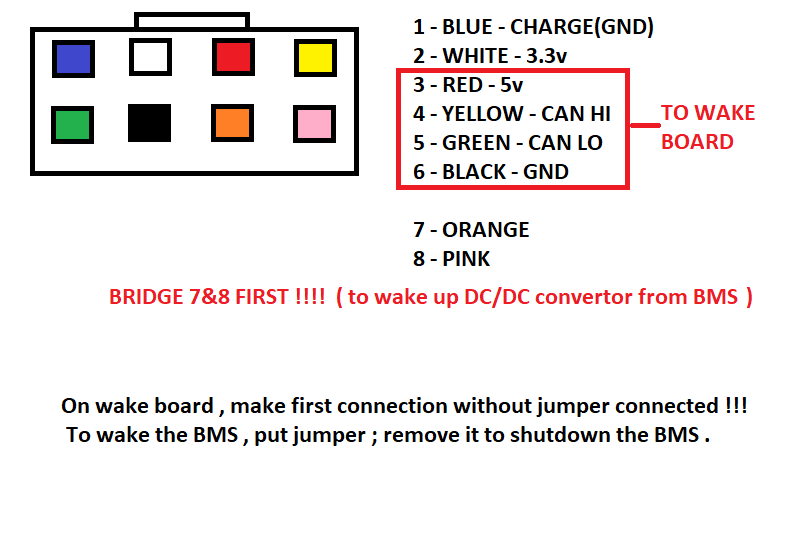
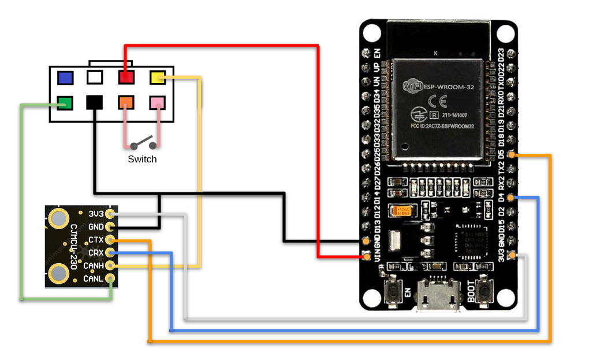

# Arduino - ESP32 - Manage INR18650MH1 by CAN Bus

## Overview

Some code to run an autonomous setup able to start an INR18650MH1 battery pack and send back the info using CAN Open protocol.
ESP32 was chosen for its onboard SJA1000 able to communicate to a simple CAN transceiver and send data via Bluetooth to a Mobile phone

## Features

* Enable power up to 30A
* Read key metrics from the battery:
  - charge
  - voltage
  - current
  - max capacity
* Send the metrics to mobile via Bluetooth (UART)

## Prerequisites

### Knowledge

* [Understand CAN](https://www.youtube.com/watch?v=FqLDpHsxvf8)
* [Understand CANopen](https://www.youtube.com/watch?v=DlbkWryzJqg)
* [Understand ESP32](https://randomnerdtutorials.com/getting-started-with-esp32/) ESP32 is simple, most common issue: the USB cable you are using is not good
* [Have an idea of what we try to achieve](https://www.youtube.com/watch?v=E87EcLeqIX0)

### Software

* Install Arduino IDE: https://www.arduino.cc/en/software
* Install ESP32 board in Arduino IDE: https://randomnerdtutorials.com/installing-the-esp32-board-in-arduino-ide-windows-instructions/
* Install Sandeep Mistry's Arduino-CAN Library: https://github.com/sandeepmistry/arduino-CAN#installation

## Hardware

* [Espressif ESP32](http://espressif.com/en/products/hardware/esp32/overview)'s built-in [SJA1000](https://www.nxp.com/products/analog/interfaces/in-vehicle-network/can-transceiver-and-controllers/stand-alone-can-controller:SJA1000T) compatible CAN controller with an external 3.3V CAN transceiver
* [VP230 / SN65HVD230](https://www.openimpulse.com/blog/products-page/product-category/sn65hvd230-can-bus-transceiver-module) CAN Bus Transceiver. **IMPORTANT!** Some of the cheap modules have a faulty resistor: [Swap the resistor for a 150 Ohm](https://github.com/nopnop2002/Arduino-STM32-CAN#troubleshooting)
* Some wires
* A switch
* A **charged** INR18650MH1 battery pack 

### Wiring

| CAN transceiver | ESP32 | Battery | Switch |
| :-------------: | :---: | :---: | :---: |
| 3V3 | 3V3 |
| GND | GND | 6 (black) | |
| CTX | GPIO_5 | | |
| CRX | GPIO_4 | | |
| CANH | | 4 (yellow) | |
| CANL | | 5 (green) | |
| | VIN | 3 (red) | |
| | | 7 (orange) | Pin 1 |
| | | 8 (pink) | Pin 2 |

## Installation

1. Open the file in Arduino IDE (Make sure it is ready to target ESP32. Did you manage to run the Blink program?)
2. Flash the ESP32 with the software
3. Wire everything
4. Switch on
5. The battery should deliver some current on the power plug

## Sources

* https://github.com/jonans/jump_bms
* https://github.com/alex3dbros/LGH1ScooterPackPower
* https://github.com/sandeepmistry/arduino-CAN
* https://github.com/nopnop2002/Arduino-STM32-CAN

## License

This library is [licensed](LICENSE) under the [MIT Licence](http://en.wikipedia.org/wiki/MIT_License).

